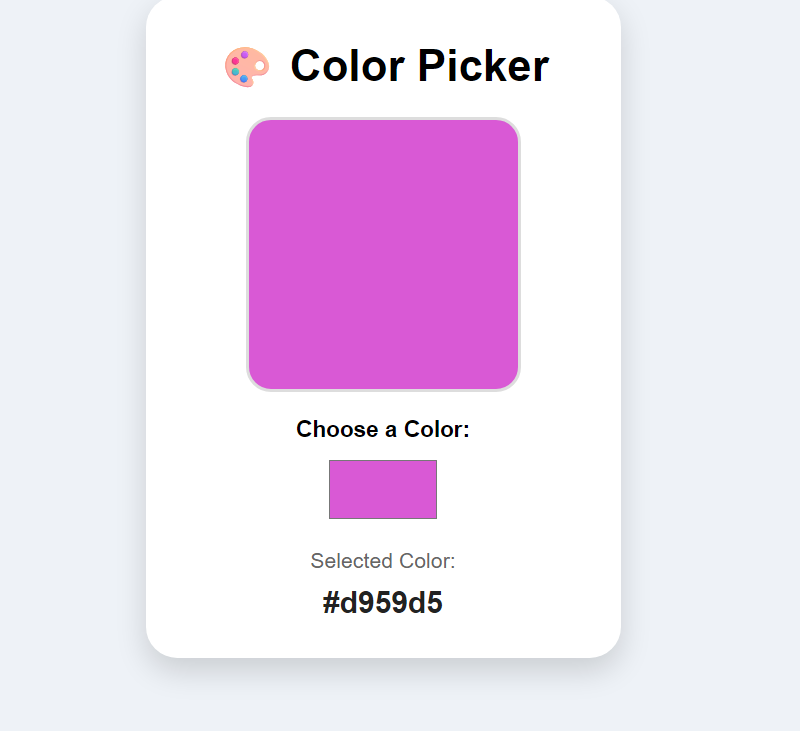

# Color Picker

A simple and responsive Color Picker application built with React. Users can select any color, view a live preview, and see the corresponding HEX color code instantly.

## Live Demo

https://your-vercel-link.vercel.app/

## Features

- Select any color
- Live color preview
- Displays HEX color code
- Responsive design
- Built using React Hooks

## Tech Stack

- React.js
- JavaScript (ES6)
- HTML5
- CSS3

## Preview



## Installation

```bash
git clone <repository-link>
cd color-picker
npm install
npm run dev
```

## Author

**Reshma**

Github: https://github.com/Reshma0927
LinkedIn: https://www.linkedin.com/in/gandetireshma0927/